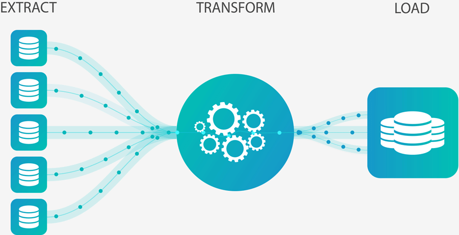
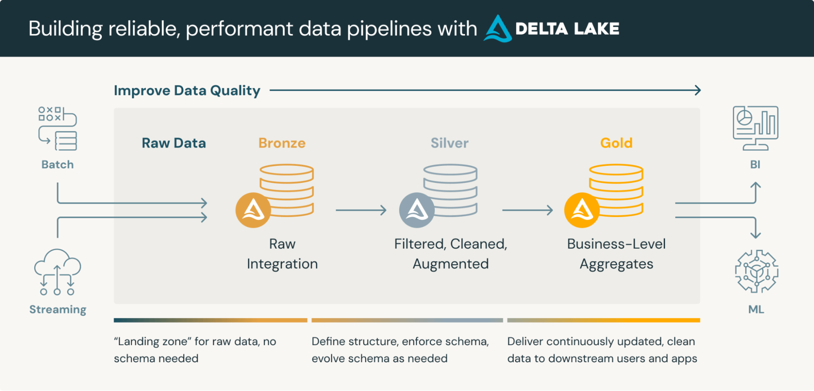

<h1>Lakeflow Spark Declarative Pipelines</h1>

***(formerly Delta Live Tables)***

---

**Contents**:

- [DLT to SDP](#dlt-to-sdp)
- [Simplifying ETL](#simplifying-etl)
- [Motivation with Regards to CDC in DLT](#motivation-with-regards-to-cdc-in-dlt)
- [Medallion Architecture](#medallion-architecture)
  - [Overview](#overview)
  - [DLT (and SDP) Across Medallion Architecture Layers](#dlt-and-sdp-across-medallion-architecture-layers)
    - [**SIDE NOTE: Potential Role of Auto Loader**](#side-note-potential-role-of-auto-loader)

---

SDP = Spark Declarative Pipelines  
DLT = Delta Live Tables

# DLT to SDP

The product formerly known as Delta Live Tables (DLT) has been updated to Lakeflow Spark Declarative Pipelines (SDP). If you have previously used DLT, there is no migration required to use Lakeflow Spark Declarative Pipelines: your code will still work in SDP. In Python code, references to `import dlt` can be replaced with `from pyspark import pipelines as dp`, which also requires the following changes:

* `@dlt` is replaced with `@dp`.  
* The `@table` decorator is now used to create streaming tables  
  *The new `@materialized_view` decorator is used to create materialised views*  
* `@view` is now `@temporary_view`

**Reference**: [What happened to Delta Live Tables (DLT)? | Databricks on AWS](https://docs.databricks.com/aws/en/ldp/where-is-dlt)

# Simplifying ETL

DLT (not SDP) provides one of the key solutions to build and manage, reliable and robust data engineering pipelines that can load streaming and batch data and deliver high-quality data on the Databricks lakehouse platform.

DLT (now SDP) offers 2 aspects of ELT pipelines:

- Simplifies ETL development process by building maintenance-free pipelines
- Provides a reliable automatic data testing capability   … *with deep visibility for monitoring and recovery of the data*

> **Reference**: [Delta Live Tables : Simplify the ETL Process | by Riya Khandelwal | Medium](https://medium.com/@riyukhandelwal/delta-live-tables-simplify-the-etl-process-46501c4bb89e)

# Motivation with Regards to CDC in DLT

Change Data Capture ([CDC](https://en.wikipedia.org/wiki/Change_data_capture)) is a process that identifies and captures incremental changes (data deletes, inserts and updates) in databases, like tracking customer, order or product status for near-real-time data applications. CDC provides real-time data evolution by processing data in a continuous incremental fashion as new events occur. Choosing the right CDC approach is critical as it allows for seamless real-time centralisation of all data changes in your ETL pipeline across multiple environments.

***Before CDC was implemented in DLT…***  
By capturing CDC events, Databricks users can re-materialise[^1] the source table as Delta Table in Lakehouse and run their analysis on top of it, while being able to combine data with external systems. The MERGE INTO command in Delta Lake on Databricks enables customers to efficiently upsert and delete records in their data lakes (for more depth on this, see: [Simplifying Change Data Capture with Databricks Delta](https://www.databricks.com/blog/2018/10/29/simplifying-change-data-capture-with-databricks-delta.html)). This is a common use case that we observe many of Databricks customers are leveraging Delta Lakes to perform, and keeping their data lakes up to date with real-time business data.

***CDC in DLT…***

While Delta Lake provides a complete solution for real-time CDC synchronisation in a data lake, the CDC feature in DLT makes the architecture even simpler, more efficient and scalable. DLT allows users to ingest CDC data seamlessly using SQL and Python.  
***Earlier CDC solutions with Delta Tables were using MERGE INTO operation, which requires manually ordering the data*** to avoid failure when one or more new rows of the source dataset match older rows at certain column values while attempting to update these older rows of the target Delta Table. To handle the out-of-order data, there was an extra step required to preprocess the source table using a for each batch implementation to eliminate the possibility of multiple matches, retaining only the latest change for each key. ***The new APPLY CHANGES INTO operation in DLT pipelines automatically and seamlessly handles out-of-order data without any need for data engineering manual intervention.***

> **Reference**: [Simplifying Change Data Capture With Databricks Delta Live Tables](https://www.databricks.com/blog/2022/04/25/simplifying-change-data-capture-with-databricks-delta-live-tables.html)

# Medallion Architecture

## Overview

A medallion architecture is a data design pattern used to logically organize data in a lakehouse, with the goal of incrementally and progressively improving the structure and quality of data as it flows through each layer of the architecture (from Bronze ⇒ Silver ⇒ Gold layer tables). Medallion architectures are sometimes also referred to as "multi-hop" architectures.

> **Reference**: [What is a Medallion Architecture?](https://www.databricks.com/glossary/medallion-architecture)

## DLT (and SDP) Across Medallion Architecture Layers

DLT (and now SDP) handles data pipelines across the medallion architecture’s layers.

### **SIDE NOTE: Potential Role of Auto Loader**

The Auto Loader (see: [Auto Loader](https://docs.google.com/document/d/132MihuemZ9G5fWOpIX2nvG3lAuUaqK48p5_EzjvtFNo/)) can be used for the first stage, i.e. from raw data to the bronze layer, when the intent is to ***process streaming data incrementally*** (although note that Auto Loader is not the right tool to use for batch data processing). *Indeed, the Auto Loader tool and data source is part of SDP.*

***Example usage…***

(*Quoting from source*) According to the Medallion architecture paradigm, the bronze layer holds the most raw data quality. ***At this stage we can incrementally read new data using Auto Loader from a location in cloud storage***. Here we are adding the path to our generated dataset to the configuration section under pipeline settings, which allows us to load the source path as a variable. This use case is given in the section “Ingesting the raw dataset using Auto Loader” in [Simplifying Change Data Capture With Databricks Delta Live Tables](https://www.databricks.com/blog/2022/04/25/simplifying-change-data-capture-with-databricks-delta-live-tables.html).

[^1]:  **Materialization** refers to the process of executing a computation or query and physically storing the results as data in a physical storage medium (like disk or memory), often in a database object called a materialized view or a temporary table. **Re-materialization** means redoing materialisation for past data analysis or review.