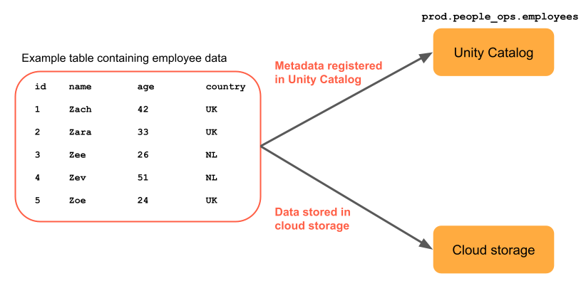

<h1>Managed Tables & External Tables</h1>

---

**Contents**:

- [Tables in Databricks](#tables-in-databricks)
- [Broad Conceptual Difference](#broad-conceptual-difference)
- [External Table](#external-table)
  - [Definition](#definition)
  - [Usage](#usage)
  - [Supported File Formats](#supported-file-formats)
  - [Converting an external table into a managed table](#converting-an-external-table-into-a-managed-table)

---

# Tables in Databricks

In Databricks, a table consists of two main components: its definition/signature, which provides metadata about the table, and the actual data itself (source: [Managed Vs External Tables In Azure Databricks | by Santosh Joshi | Art of Data Engineering | Medium](https://medium.com/art-of-data-engineering/managed-vs-external-tables-in-azure-databricks-56242b88d938)). In modern Databricks, Unity Catalog (UC) manages the metadata for tables, whose data may be stored in a managed storage or an external storage, as illustrated below:

> **Source**: [Databricks tables concepts](https://docs.databricks.com/aws/en/tables/tables-concepts)

# Broad Conceptual Difference

If Databricks manages both components, the table is classified as a **managed table**, meaning Databricks handles its entire lifecycle. However, if Databricks only manages the metadata while the data resides externally, the table is referred to as an **external table**.

> **References**: [Managed Vs External Tables In Azure Databricks | by Santosh Joshi | Art of Data Engineering | Medium](https://medium.com/art-of-data-engineering/managed-vs-external-tables-in-azure-databricks-56242b88d938)

# External Table

## Definition

In UC, an external table stores its data files in cloud object storage within your cloud tenant. UC continues to manage the table's metadata, ensuring full data governance across all queries. However, it does not manage the data's lifecycle, optimization, storage location, or layout.

When you define a UC external table, you must specify a storage location. This location is an external location registered in UC. When you drop an external table, UC removes the table metadata but does not delete the underlying data files.

## Usage

***In most cases, Databricks recommends using UC managed tables*** *to take advantage of automatic table optimisation, faster query performance, and reduced costs*. However, Databricks recommends using external tables when you need to:

- Register a table backed by existing data not compatible with managed tables  
- Have direct access to non-Databricks clients’ data from   … *that do not support other external access patterns*

**NOTE**: *UC privileges not enforced when users access data files from external systems.*

## Supported File Formats

External tables can use the following file formats:

- DELTA  
- CSV  
- JSON  
- AVRO  
- PARQUET  
- ORC  
- TEXT

> **Reference**: [Work with external tables | Databricks on AWS](https://docs.databricks.com/aws/en/tables/external)

## Converting an external table into a managed table

Use the `SET MANAGED` feature to convert an external table to a Unity Catalog managed table in Databricks (used using the `ALTER TABLE ... SET MANAGED` command). While you can also use `CREATE TABLE AS SELECT` (CTAS) for conversion, Databricks recommends using `SET MANAGED` for the following benefits:

- Minimising reader and writer downtime.  
- Handling concurrent writes during conversion.  
- Retaining table history.  
- Keeping the same table configurations, including the same:  
    - Name  
    - Settings  
    - Permissions  
    - Views  
- Ability to roll back a converted managed table to an external table

> **Reference**: [Convert an external table to a managed Unity Catalog table | Databricks on AWS](https://docs.databricks.com/aws/en/tables/convert-external-managed)