<h1>Data Intelligence using Databricks</h1>

***A Dialogue Between 2 Noobs***

---

**Contents**:

- [Integration is the Backbone of Intelligence](#integration-is-the-backbone-of-intelligence)
- [Wrangling the Eternal Dump of Heterogenous Data](#wrangling-the-eternal-dump-of-heterogenous-data)
- [Fishing in a Data Lakes](#fishing-in-a-data-lakes)
- [The Data Lakehouse Architecture](#the-data-lakehouse-architecture)
- [Delta Lake](#delta-lake)
- [Databricks](#databricks)
- [Data Intelligence via Databricks](#data-intelligence-via-databricks)
  - [Intent of Databricks vis-a-vis Data Intelligence](#intent-of-databricks-vis-a-vis-data-intelligence)
  - [KEY DETAIL: *Databricks is a Distributed System Based on Spark*](#key-detail-databricks-is-a-distributed-system-based-on-spark)
  - [KEY DETAIL: Layers of the Platform](#key-detail-layers-of-the-platform)
  - [Topsoil of the Platform: Delta Lake \& Unity Catalog](#topsoil-of-the-platform-delta-lake--unity-catalog)
  - [Layers of Data Intelligence](#layers-of-data-intelligence)
    - [Lakeflow for Data Ingestion \& Transformation](#lakeflow-for-data-ingestion--transformation)
    - [Databricks SQL for Exploratory Analytics \& Warehousing](#databricks-sql-for-exploratory-analytics--warehousing)
    - [AI/BI for Business Intelligence Purposes](#aibi-for-business-intelligence-purposes)
    - [Mosaic AI for AI/GenAI Applications](#mosaic-ai-for-aigenai-applications)
    - [Conclusion: More than a Warehousing Alternative](#conclusion-more-than-a-warehousing-alternative)
- [Key Concepts of Databricks](#key-concepts-of-databricks)
  - [Namespace Structure](#namespace-structure)
  - [Workspace](#workspace)
- [Databricks for Data Engineering](#databricks-for-data-engineering)
  - [What is Data Engineering?](#what-is-data-engineering)
  - [Key Responsibilities of Data Engineers](#key-responsibilities-of-data-engineers)
  - [Principles of Data Engineering](#principles-of-data-engineering)
  - [Databricks-Enabled Data Engineering](#databricks-enabled-data-engineering)
  - [Read More](#read-more)

---

# Integration is the Backbone of Intelligence

"Say, Asha, I was just thinking of intelligence."

"What kind? And what about it?"

"The way I see it, intelligence is the ability to gather information and make it actionable. And it's an ability recursively applied, usually, since information often leads to questions, which are themselves actionable thoughts, since they spur you to act to gather more information and make it actionable for the broader purposes your questions are supposed to serve."

"Uh... Alright. I see your point. To put it my way, you're saying that intelligence is the ability to engage with information productively and purposefully. But I sense that you're getting at something specific."

"I am. You see, the quality of the outcome of intelligence depends on the quality and quantity of the information it engages with."

"Hm. Quality and quantity. By quality, do you mean its accuracy, its structure, or...?"

"I simply mean that the information should be of the kind you need. Sometimes, for, say, meteorological study, a table of sensor measurements is what's most convenient to consolidate the myriad data from myriad sources. Other times, for, say, extracting text from images, you need, well, images with text. Yet other times, for, say, figuring out how the policies of a business apply to a certain business proposal, you need the documents in which the policies are written."

"Huh, okay, that's what you mean. And why is quantity relevant?"

"It is relevant when patterns in the data are hidden amid the effects of a variety of extraneous factors, or when there are many considerations to take into account to approach a problem — as in multi-factor causation or a multi-dimensional mapping between dependent and independent variables. In most complex problems, there often are many considerations. For example, to program a robot to move within a crowded place, you must consider its odometry, correct for the drift in its odometry over time, adjust its reactiveness, consider how it plans and replans... Imagine the data you'd need for it. Constant visual input, a continuous stream of odometry, the up-to-date map of the environment, and so on."

---

**CONCEPTUAL NOTE**:

Kafka dealt with data integration in motion, i.e. data streams from many sources to many sinks. Now, we're dealing with data integration at the storage level, at rest, from which we search insights and understanding. Both are integration for intelligence, but at different levels.

# Wrangling the Eternal Dump of Heterogenous Data

"Right. So quality and quantity of information matter for intelligence to be effective. So, what are you getting at here?"

"I'm getting at the idea that information, any that we need or could need, should be all in one place so we don't have to deal with the cognitive overload of scrounging and scavenging for the data we need, and so we don't have to maintain a sprawling infrastructure for the many kinds of data from many sources. Just one source to rule them all."

"Well, is this one source... a data lake? Is that what you're referring to?"

"That's a start, but even if it is one source, processing it can be a nightmare. I mean, imagine dumping your documents in a massive pile and expecting it to serve you as your library. We need an intermediary, an angelic librarian to sort this for us."

"But even if she sorts it for you, what about new stuff that'd come later? Moreover, what if you've got not just documents but tapes, CDs, pictures and pottery shards or whatever, as varying in size and scope as they are varying in kind? That's closer to what you were getting at."

"Oh my god, yes, what about them? We can't just sort and be done with it, and we can't expect the poor librarian to keep sorting this ever-growing unholy pile over and over! Leave aside the cognitive overload of wrangling data from many sources, what about the cognitive overload of this eternal dump of heterogenous data?"

"Ah. So, we've come to data lakehouses, haven't we?"

"What? I need to know more!"

---

**CONCEPTUAL NOTE**:

Data lakes represent the approach of "schema-on-read", i.e. data is organised, validated and processed on demand, when read. This contrasts with "schema-on-write" as in a data warehouse, which ensures data is organised and validated when writing to the data storage, removing this burden from future read operations. Hence, we have the alternative of (a) flexibility with inefficiency in access, especially repeated access, and (b) efficiency in organisation and access but inflexibility in data structure. Data lakehouses, as we shall see, try to get the best of both worlds by implementing schema-on-write from the user's perspective while performing schema-on-read along with metadata organisation internally, allowing for the flexibility of a data lake and the efficiency of a data warehouse.

# Fishing in a Data Lakes

"Alright, Minerva, let's get back to your pile. Perhaps, more poetically, we can see it as a lake of data, the data being of any format. Lakes leave fish to swim free and unfettered, which means it is up to the fisherman in his lakehouse to find a way to feed his needs, from drawing out the fish to catching, cleaning and cooking them. I must say that this is not the most apt metaphor, because unlike fish, the same data can be and often needs to be accessed and updated by many readers and writers, sometimes at once."

"Okay, then what does this metaphor, such as it is, mean when we're speaking of data?"

"It means the data lake does not support transactions — ACID transactions — and does not enforce data quality or constraints. It's just a lake, after all, not a farm or a factory!"  
"ACID... Atomicity, consistency, isolation and durability, right? Let me see... If a data lake is similar in its core capabilities as any old disk storage, then if we write some data and our system crashes halfway, we've still written half the data, which means the write does not either succeed or fail as a whole — it may be in some state of partial success or failure. So, not atomic."

"Yes, which means it's hard to ensure that data appends and updates don't lead to incomplete or corrupted data."

"Right. And because we're not validating written data for any internal rules or constraints, we've got no way to ensure whether the data in storage is valid for our purposes or not. So, not consistent."

"And on top of this, with the lack of isolation, we're vulnerable to race conditions. In a race condition, the outcome of a sequence of reads and writes — sometimes done by different people for different purposes — are not coordinated, which means there is no guarantee that writes would result in the expected updates, since other writes could overwrite them, and that reads would result in up-to-date data, since new writes may occur right after the read."

"And finally durability. What about durability? I mean, a data lake is a store after all."

"Yes, durability is taken care of, but the rest are not. And, we can imagine how chaotic access and updates can get without these other properties."

"Hm. More precisely, tying back to the needs of intelligence to integrate well, without these other properties, both the quality and the quantity of data can suffer. Quality suffers due to incomplete, invalid or unreliable data, owing to the lack of atomicity, consistency and isolation respectively. Quantity suffers due to the fact that we may not be able to trust existing data and may either make cleaning data a costly affair (thus, we may end up having to make do with less data) or prune more data than we need in order to ensure data quality for our purposes. In the end, intelligence suffers."

"Indeed. Going back to our angelic librarian — the stand-in for our solution — she may well find the books she needs, but without ACID, she can't be sure which books have missing pages or have messed up contents or might change their contents while she's reading them. Sure, she can give us the books we want or the information from them that we need, but when she's not sure, the burden of validation falls upon us, and such validation is no mean task when we're just simple readers and writers trying to make our way through the galaxy of data."

"Is this what the data lakehouse aims to solve for?"

"Yes. An astronomer can only do astronomy when she trusts her instruments, and as good of an astronomer as she may be, she'd not necessarily know the ins and outs of the instrument's design and development; it's the heavens and not the instrument itself that's the object of her desires. The same goes for data engineers, data scientists, analysts and whoever in the world wants to use data intelligently. Let their intelligence be applied to the problem at hand, not on dealing with the data itself, you see?"

"I see. Let's go to the solution then!"

> **Reference**: [What is a Data Lakehouse? | Databricks](https://www.google.com/url?q=https://www.databricks.com/glossary/data-lakehouse&sa=D&source=editors&ust=1777921720738143&usg=AOvVaw2DuhCYb8hQ56q9k-g71y4v)

# The Data Lakehouse Architecture

Asha paused for a moment, considering how to begin, when Minerva spoke, "Here's what I see."

Asha was pulled out of her thoughts, but she was not upset as much as eager for the potential launch-pad. "Tell me."

"You can't actually organise data within the data lake itself, right? I mean, it's a dump that's kind of supposed to be a dump, cheap, quick and flexible."

"Right. We do want this cheapness, quickness and flexibility."

"Okay, so we must add a layer on top of it to decouple the data storage itself from its organisation. Kind of like keeping track of the locations of the volumes and versions in a book-series without ensuring they are organised in-location itself."

"That's right! You've hit the essence of the data lakehouse architecture, the metadata layer. Among all the layers in the data lakehouse architecture, this is the layer that makes a data lakehouse a data lakehouse."

"And the other layers? Can you go through them?"

"That was the plan, but I was afraid of launching into a list without capturing the list's essence. But now we've captured its essence, let's talk about the whole."

"Okay..."

"First, of course, the ingestion layer, which is key to a data lake, which in turn is the soil from which a data lakehouse arises. This layer is the layer that ingests data into the data lake from one or more sources, which could be, say, databases, APIs, real-time data streams, applications — like CRM applications — and more."

"This is the layer in which something like Apache Kafka would come in, right? For real-time data streams?"

**NOTE**: *Apache Kafka is mentioned because this is relevant for me, the writer, in my applications, and because I had just delved into it as a part of my learning. As such, it does not have any special significance to data lakehouses or Databricks, so do not be thrown off by the special mention.*

"That's right. The second layer is, of course, the storage layer, which is the data lake itself. Now, it is key to note that to be able to access the data through any authorised third-party, we need to make sure the data lake can be interacted with using a tool or an API, and for this purpose, we need to make sure the objects in the data lake can be read directly using open file formats and metadata, metadata being where the schemas of structured and unstructured datasets are kept."

"Did you mention open file formats to ensure there are no proprietary restrictions put on the third-party accessing the data?"

"Yes, indeed, though I must say this is a practical consideration and not essential to the architecture itself."

---

**TERMINOLOGY NOTE 1: Schema vs. format**:

A schema defines the abstract blueprint and rules for data structure and content, while a format/data structure is the concrete syntax or method used to express and store that data. Specifically, a schema is a high-level, abstract description of how data is organized, including the names of data elements, their data types, and the relationships and constraints between them. It acts as a blueprint that ensures data consistency that allows the data to be interpreted consistently across different applications.

**TERMINOLOGY NOTE 2: Open file format**:

An open file format is a public, standardized way to store digital data, meaning anyone can use it without proprietary restrictions, ensuring interoperability across different software (like text, images, or data) and preventing vendor lock-in, with examples including JPEG, SV, PDF, and OpenDocument (ODT), contrasting with closed formats controlled by a single company.

"I see. Well, we've gone through ingestion and storage. I'm guessing now we're getting into the metadata layer at last."

"Yes, we are! This is where the fun begins. The metadata layer manages and organises the metadata associated with the data that's been ingested and stored. This metadata goes beyond the metadata that comes with the object when ingested, as it also keeps track of operational data such as recent users and changes, past data quality incidents, orchestration jobs through which these data were ingested, transformation models these data went through, and so on."

"Hm. I suppose this additional metadata — this operational data, as you put it — helps implement atomicity and isolation, right? Atomicity could at least be verified by keeping track of data quality incidents, and isolation is implemented as every change is added to a transaction log — sequential log of changes you'd implied — allowing for rollback or, perhaps, allowing access to specific past versions of the data that may be retained as it is."

"That's right, this additional metadata is what's key to let us ensure ACID properties in later transactions. As for consistency, the metadata can certainly help us here as well by maintaining the data schemas."

---

**ADDITIONAL INSIGHT BASED ON MINERVA'S OBSERVATIONS**:

The metadata layer enables time travel. Because every change is logged and old versions can be retained, you can query data "as of yesterday" or "as of before that bad ETL (extract-transform-load) job ran." This is transformative for:

- Debugging data quality issues
- Auditing and compliance
- Reproducing past analyses
- Rolling back mistakes

---

"There we go! I find this so clever, for it is far easier to organise and keep track of metadata than it is to organise and keep track of the data itself. And with metadata such as transaction logs and schema constraints — perfect! But it's still just the framework. I'm guessing there are more layers to come?"

"Yes, 2 more. First is the API layer. APIs enable third-party applications — such as analytics tools — to query the data stored in the data lake via the data lakehouse architecture. This is where the ACID properties are ensured in earnest. As an aside, note that nothing in the architecture stops us from implementing an API for real-time data streams, so we can certainly have real-time data analysis applications on the other end. Now, after the API layer, of course, now that we've got the data neat and tidy, we have the data consumption layer, or rather the application layer, which are the end applications that customers actually use, accessing the data lake's objects via the API layer that sits atop the metadata layer."

"Wow. This is neat. Ingestion layer → Storage layer → Metadata layer → API layer → Application layer. Oh, of course, the requests go in the reverse direction."

"There you go. Schema-on-read at the storage layer, as it is just a data lake until that point, and schema-on-write implemented indirectly at the metadata and API layers. We'll now get into the nitty-gritty with the implementation of the data lake architecture I want to engage with: Delta Lake, which is part of the Databricks ecosystem."

> **References**:
>
> - [5 Layers Of Data Lakehouse Architecture Explained](https://www.google.com/url?q=https://www.montecarlodata.com/blog-data-lakehouse-architecture-5-layers/&sa=D&source=editors&ust=1777921720751813&usg=AOvVaw3EC4vtVVafqmBA1oqkgUVT)
> - [What is a database schema? | RecordPoint](https://www.google.com/url?q=https://www.recordpoint.com/blog/what-is-a-database-schema&sa=D&source=editors&ust=1777921720752144&usg=AOvVaw1N1iaJsInoeP4Wdym01sd5)
> - [Open File Formats | NNLM](https://www.google.com/url?q=https://www.nnlm.gov/guides/data-glossary/open-file-formats&sa=D&source=editors&ust=1777921720752391&usg=AOvVaw2ZuRQIyi6INwhdBCPR4qQz)
  
# Delta Lake

"Delta Lake — a brainchild of Databricks — is both an open-source table format for and an implementation of the data lakehouse architecture. Together, this makes Delta Lake a protocol — i.e. format + method to process data in this format — with an engine to implement the protocol. Hence, Delta lake as a whole is a data storage framework/layer, rather than just a data storage format/medium. Now, note that we've revealed 2 sides of Delta Lake: (1) the passive specification, i.e. the format and the protocol, and (2) the active implementation, i.e. the protocol-implementation engine."

---

**CRUCIAL CONCEPTUAL NOTE: Table format vs. file format**:

The Delta Lake format is NOT a file format, i.e.  it is NOT a format in which to store and access data from a single file (e.g. Parquet, which Delta Lake uses for its data files). Instead, Delta Lake is a format to store a table, which can be spread across files and (as we shall see) can be associated with other files regarding its metadata, versions, etc. Hence, a table is a data structure that is at a higher level of abstraction than a file, and Delta Lake deals with this higher level of abstraction (we shall soon discover how).

---

"Passive specification? This, I suppose, sets the stage for the metadata layer but doesn't implement it by itself."

"Right. This passive specification is the specification of an open-source table format for tabular data in the storage layer. It extends Parquet data files with a metadata layer to manage transaction logs (to enable/validate ACID transactions), versioning (e.g. keeping track of the versions of the Parquet data file) and schema enforcement."

"If it extends Parquet data files with all these features, and if a table can be spread across multiple files (which must be possible for scalability) and if past versions of the data are to be stored, then the Delta Lake format must mean a sort of directory structure for each table, with data files holding the data and sub-directories holding the metadata?"

"Exactly! Here's an example:

```
my_table

├── _delta_log/

│   ├── 00000000000000000000.json                # Initial state

│   ├── 00000000000000000001.json                # Transaction 1

│   ├── 00000000000000000002.json                # Transaction 2

│   └── 00000000000000000010.checkpoint.parquet  # Checkpoint

├── part-00000-xxx.snappy.parquet                # Data file 1

├── part-00001-xxx.snappy.parquet                # Data file 2

└── part-00002-xxx.snappy.parquet                # Data file 3
```

..."

---

**MORE ABOUT THIS FORMAT**:

What the specification defines:

1. Transaction log structure (\_delta\_log/):
   - Sequential JSON files numbered in base-10, zero-padded to 20 digits
   - Each file represents an atomic transaction
   - Contains actions like:
     - **add**: Add a data file to the table
     - **remove**: Mark a data file as removed (logical deletion rather than physical deletion)
     - **metaData**: Set table schema, partition columns, configuration
     - **protocol**: Define required reader/writer versions
     - commitInfo: Metadata about who made the change and when
2. Checkpoint files:
   - Periodic Parquet snapshots of the transaction log state
   - Prevent the need to read thousands of JSON files of actions to access previous data states
   - Typically created every 10 commits
3. Parquet extensions:
   - Data files remain standard Parquet (no modification)
   - This is crucial: Any tool that reads Parquet can read Delta data files <br> Why this matters:
     - No lock-in: If you abandon Delta Lake, your data is still accessible
     - Tool compatibility: DuckDB, pandas, Arrow, etc. can read the data files directly
     -  Graceful degradation: Without the `_delta_log/`, you lose ACID/time-travel but keep data access

---

"Hah. Nice. Now, you said this is a format for the storage layer? Isn't that... the data lake? Along with a transaction log for ACID transactions and scalable metadata handling, it also covers the metadata layer, right? Doesn't that make the Delta Lake format the keystone of data lakehouse implementations?"

"Right. It is a keystone, as you said, crucial for its active implementation. But all it really does is add a metadata layer on top of Parquet files. Dealing with this metadata in a way that makes use of it appropriately — that's the scope of the active implementation."

"Ah, the engine, i.e. the libraries and software systems that run these libraries."

"Yes. The Delta Lake libraries provide implementations for reading, writing and validating the transaction log metadata that's a part of the Delta lake format. These libraries handle all metadata operations required by the Delta Lake protocol, i.e. the operations required to deal with metadata to ensure (1) every data-related operation is an ACID transaction and (2) the table's schemas are managed and maintained."

"I see... So, I suppose higher-level concerns are beyond the scope of Delta Lake, like, say, cross-table cataloging (summarising data across tables), lineage tracking (the process of documenting a data asset's journey from its origin through transformations, data transfers and usage in its destination), and metadata caching (for query optimisation, i.e. for faster retrieval of more relevant metadata, e.g. recently or frequently accessed metadata)."

---

**SIDE NOTE: Lineage tracking (using Unity Catalog)**:

Below is an example of tracking the lineage of tables (let's say, the `lineage_data.lineagedemo.dinner` table) using Unity Catalog in Databricks. Broadly, there are 2 directions for lineage: downstream (where the data asset being tracked is used/transformed further) and upstream (how the data asset emerges from/combines previous data assets and their transformations).

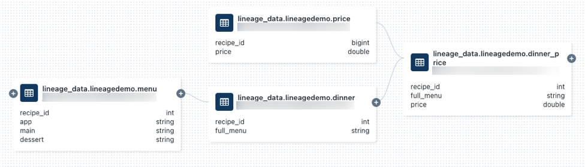

> **Source**: [Capture and view data lineage using Unity Catalog | SAP Databricks](https://www.google.com/url?q=https://docs.databricks.com/sap/en/data-lineage&sa=D&source=editors&ust=1777921720765376&usg=AOvVaw0AMcK5_9sNYRjZh_sk59cd)

---

"That's right. All these higher-level concerns are separate from the core transaction log management offered by Delta Lake."

"So, let me get this straight. Delta Lake covers the storage layer and the metadata layer using its format, protocol and protocol-implementation engine."

"Right. It's the data plane, not the control plane or the application plane."

> **Reference**: [What is Delta Lake in Databricks?](https://www.google.com/url?q=https://docs.databricks.com/aws/en/delta/&sa=D&source=editors&ust=1777921720766547&usg=AOvVaw0LyDApxW2QdMf3P-e_VuMh)

# Databricks

"So far, we've discussed the conceptual core, i.e. the data lakehouse architecture. Now, let's move on to a powerful platform that implements, expands on and enriches this conceptual core — Databricks."

"A platform, huh? From what I know, in computer science, a platform is an environment — i.e. the set of interrelated, interacting components, such as hardware, operating system and frameworks (i.e. libraries, formats, APIs, protocols, etc.) — where software runs, acting as a foundation for software applications, similar to how a dance platform acts as a foundation for dance performances."

---

**TECHNICAL NOTE**:

In modern usage, "platform" often implies:

- Extensibility: You can build on top of it
- Ecosystem: Multiple applications/services interact through it
- Abstraction: It hides underlying complexity

Databricks fits all 3 criteria perfectly.

---

"That's right. Now, note that the data lakehouse architecture — as implemented by Delta Lake — is the beating heart of the platform that is Databricks. To be precise, Databricks is at its core a cloud-hosted data lakehouse platform."

---

**SIDE NOTE**:

Why the beating heart metaphor is apt:

Delta Lake provides:

- **Circulation**: Data flows through the transaction log
- **Rhythm**: ACID transactions provide ordered, reliable operations
- **Life**: Without ACID and reliable storage, the platform cannot function

---

"Huh. Does this mean it's a cloud service of sorts?"

"Not by itself, no. Databricks on its own is a software platform that's meant to be run in a cloud platform, and this can be any cloud platform, be it Amazon Web Services (AWS), Azure, Google Cloud Platform (GCP), etc. In such cases, Databricks runs on top of the data plane provided by the cloud platform (e.g. Amazon S3 works very well as a storage layer for the data lake on which Databricks can run). Of course, Databricks (the enterprise) itself also offers Databricks (the platform) as a managed service on top of its own storage layer for a data lake, but as a platform, Databricks is simply a software platform that can run on top of any data lake. Here's an image to encapsulate this idea..."

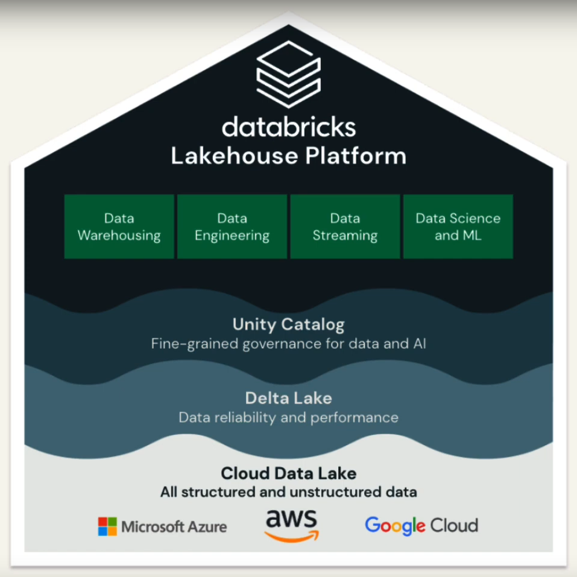

> **Source**: [Intro to Databricks Lakehouse Platform](https://www.google.com/url?q=https://www.databricks.com/resources/demos/videos/lakehouse-platform/intro-to-databricks-lakehouse-platform&sa=D&source=editors&ust=1777921720771680&usg=AOvVaw07PSb5YTfqbkc91rcSVGbc)

---

**CONCEPTUAL NOTE 1**:

S3 is a storage service, whereas a data lake is the store of data (i.e. not just the capacity but the data as well). It's the same difference as between a crater and the crater along with the lake that fills the crater.

**CONCEPTUAL NOTE 2**:

What has been implicit so far but should be made explicit is that Databricks is a cloud-agnostic platform, i.e. it can run on any cloud platform that provides a storage layer for data lakes.

---

"I see. Databricks is a system that can be run as a service in a variety of cloud platforms. But you said Delta Lake — the data lakehouse part — is the beating heart of Databricks. For what does this heart beat?"

"A lot of things. It can be a bit daunting to describe Databricks, because it has such rich and varied APIs, libraries, services and features around the data lakehouse core. Here's an image to give you an idea..."

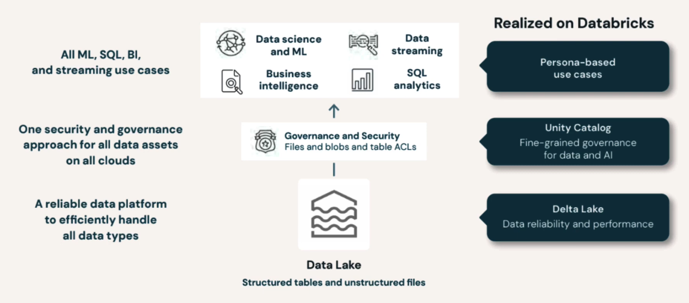

> **Source**: [Intro to Databricks Lakehouse Platform](https://www.google.com/url?q=https://www.databricks.com/resources/demos/videos/lakehouse-platform/intro-to-databricks-lakehouse-platform&sa=D&source=editors&ust=1777921720774908&usg=AOvVaw0Ob3q5jE5UEpDUaLkEuabO)

"Huh, I see. Data warehousing, data engineering, data streaming, data streaming, data science and machine learning. Wow."

"But, you see, these are all applications that rely on and rest on top of data. The symphonies are many, but the orchestra is the same. However, note that Databricks gives you the tools and the environment to set up and run these applications, but it doesn't host any particular applications out-of-box."

"I see. So, to sum up, Databricks is a cloud-agnostic data intelligence platform — built around Delta Lake — that sits on top of the storage layer and sets the stage for the application layer, hence forming the control plane that ties the data plane and the application plane together."

> **References**:
> 
> - [Intro to Databricks Lakehouse Platform](https://www.google.com/url?q=https://www.databricks.com/resources/demos/videos/lakehouse-platform/intro-to-databricks-lakehouse-platform&sa=D&source=editors&ust=1777921720776527&usg=AOvVaw3Q03AaN6PW1J0E8vW3mL1t)
> - [Databricks - Wikipedia](https://www.google.com/url?q=https://en.wikipedia.org/wiki/Databricks&sa=D&source=editors&ust=1777921720776767&usg=AOvVaw2GdvujTPSBW4Xe_Ih7fGLp)

# Data Intelligence via Databricks

## Intent of Databricks vis-a-vis Data Intelligence

"The intent of Databricks as a platform can be encapsulated in 4 key ideas:

1. Simplifying the complexity of our data estate
2. Unified data and data governance
3. AI/BI tuned to our business
4. Democratising data and AI"

---

**TERMINOLOGY: Data estate**:

The collective body/structure of an organisation's data assets along with any tools and infrastructure used to process and govern this data.

---

"Hm. To collapse these 4 points into 1, I'd say: data intelligence is about understanding context, and we want to enable and empower data intelligence while making it accessible to decision-makers at various levels of expertise and experience."

"Right you are! And there, you've given the essence of data intelligence, which distinguishes it from general intelligence: understanding the specific context of an organisation based on its specific data. This is what Databricks is about."

"Ah, but it is also about making data intelligence accessible, remember?"

"Oh yes, and these together make up the intent of Databricks as a platform."

---

**CONCEPTUAL NOTE: Data intelligence vs. Artificial intelligence**:

AI ⇒ General context reasoning

DI ⇒ Domain-specific reasoning

## KEY DETAIL: *Databricks is a Distributed System Based on Spark*

For scalability and performance, especially when processing big data, it serves us well that Databricks is built using the Apache Spark engine + framework (learn about Apache Spark here: [Distributed Computing with Apache Spark](https://www.google.com/url?q=https://docs.google.com/document/d/1Z52L78aJZBFK-ZFCenMir09MhkrT0fNHAi2k5GUhH64/&sa=D&source=editors&ust=1777921720780773&usg=AOvVaw1RA69wSBcm_Gc2Zgxc9t4q)). Hence, Databricks essentially runs on a Spark cluster, and like Spark, it has the following support:

- In-memory distributed data processing <br> (as opposed to disk read/writes for every operation, like Apache Hadoop)
- Language support for Scala, Python, R, SQL and Java <br> (e.g. for notebooks, for creating scripts for jobs, etc.)
- Batch and stream processing
- Structured, semi-structured and unstructured data <br> (by virtue of the data lakehouse architecture + Spark's map-reduce pattern)

***A Databricks cluster is the Spark cluster on which Databricks runs.***

## KEY DETAIL: Layers of the Platform

Databricks is a multi-cloud platform, i.e. it can operate on a number of cloud services, ranging from Azure to Google Cloud to Amazon Web Services (AWS). In fact, all compute and data storage occur through the chosen cloud service, within the user's cloud service account (e.g. AWS account) — this is the compute plane + the data plane. The user's Databrick's account contains the control plane, i.e. the layer where the configurations of the underlying system are managed (e.g. access controls, governance, security configurations, workflows, notebooks, etc.). Databricks also exposes the data and AI assets through web UI,, e.g. the Unity Catalog UI.

| Layers of Compute and Data Processing | Planes of Operation |
| --- | --- |
| 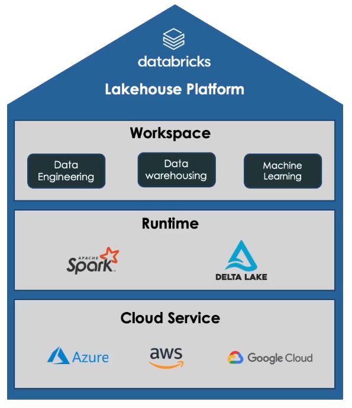 | 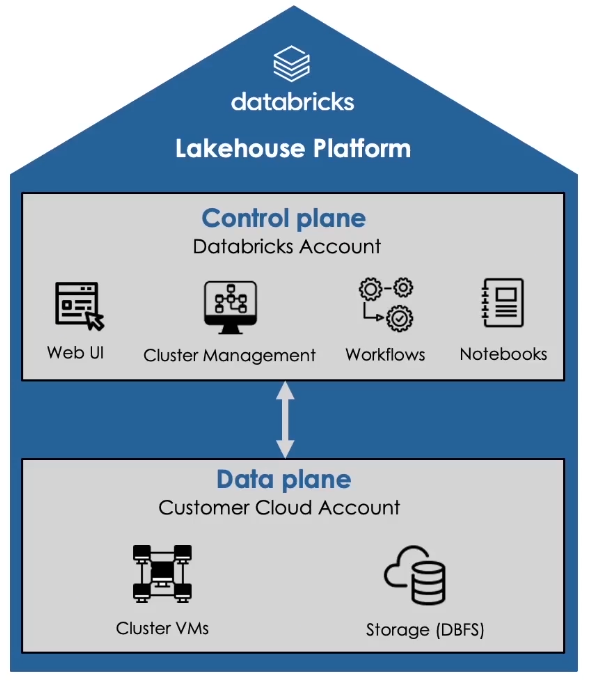 |

> **Source**: [Databricks Certified Data Engineer Associate - Preparation | Udemy](https://www.google.com/url?q=https://www.udemy.com/course/databricks-certified-data-engineer-associate/&sa=D&source=editors&ust=1777921720784686&usg=AOvVaw10DXklOsUHqtioRxOhxws1) (section 1, lesson 2)

**Explanations of key concepts**:

Workspaces have been discussed in a previous section. The runtime is simply the compute layer, which consists of the Databricks cluster (i.e. the Apache Spark cluster on which Databricks runs) and Delta Lake implemented within it. DBFS is the Databricks File System, which is an abstraction layer (running within the Databricks cluster) that manages distributed file storage within the underlying cloud storage, and this management is done through logical organisation (see image below). DBFS comes preinstalled within the Databricks cluster. An implication of this is that even after the Databricks cluster is terminated, the data is persisted within the cloud storage.

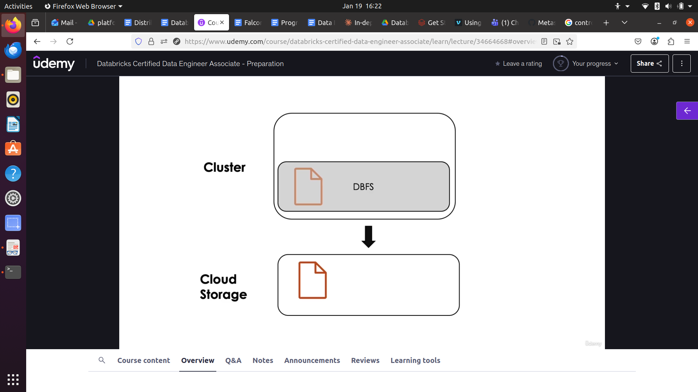

> **Source**: [Databricks Certified Data Engineer Associate - Preparation | Udemy](https://www.google.com/url?q=https://www.udemy.com/course/databricks-certified-data-engineer-associate/&sa=D&source=editors&ust=1777921720786827&usg=AOvVaw06IvX1As4dLYNrtU_2kign) (section 1, lesson 2)

**NOTE**: *This is an important architectural property: compute-storage separation.*

## Topsoil of the Platform: Delta Lake & Unity Catalog

"Before we delve into the various solutions that arise from the platform, it's important to take a look at the fertile soil in which these solutions take root."

"Surely, Delta Lake, the beating heart of Databricks, must be a part of this fertile soil?"

"It is indeed. But there's another part: Unity Catalog. Like Delta Lake, Unity Catalog is a standalone software solution that's integrated with Databricks and, through this integration, forms the basis for monitoring, governing and securing data and AI assets in Databricks."

---

**CONCEPTUAL NOTE: Catalog**:

A catalog is a complete list of items, typically one in alphabetical or other systematic order. In the context of data and AI governance, as in Unity Catalog, it is the catalog of all the tabular data, unstructured assets and AI assets on a platform (e.g. Databricks), exposed with a single interface.

---

"Hm. If it monitors, governs and secures all data and AI assets, its interface must be... multimodal, right?"

"It is. Its interface supports any format (Delta Lake, Iceberg, JSON, CSV, Parquet, etc.), any engine (e.g. Spark, Hadoop, etc.) and any asset type (AI model, tables, etc.). And what's more, its API and implementation are both open source!"

---

**KEY CONCEPTUAL NOTE: What exactly is Unity Catalog?**

Unity Catalog is a centralised data catalog that provides access control, auditing, lineage, quality monitoring, and data discovery capabilities across Databricks workspaces attached to an account/a region within the account (in the cloud platform being used as well as the corresponding Databricks account).

> **Source**: [What is Unity Catalog? - Azure Databricks | Microsoft Learn](https://www.google.com/url?q=https://learn.microsoft.com/en-us/azure/databricks/data-governance/unity-catalog/&sa=D&source=editors&ust=1777921720790811&usg=AOvVaw0KKV8RmHSuJQL7FDZghFz3)

Hence, Unity Catalog is part of the control plane, not the compute plane. It runs as a metastore service managed by Databricks. It is account-level/region-level, not cluster-level. This means Databricks clusters query Unity Catalog metadata, but do not run it.

**Metastore and using Unity Catalog**:

The metastore is the top-level container for metadata in Unity Catalog. It registers metadata about data and AI assets and the permissions that govern access to them. For a workspace to use Unity Catalog, it must have a Unity Catalog metastore attached. You should have one metastore for each region in which you have workspaces.

> **Source**: [What is Unity Catalog? - Azure Databricks | Microsoft Learn](https://www.google.com/url?q=https://learn.microsoft.com/en-us/azure/databricks/data-governance/unity-catalog/&sa=D&source=editors&ust=1777921720792399&usg=AOvVaw3YS2VIyxMXVHp30mterT_r)

---

> **References**:
> 
> - [www.unitycatalog.io](https://www.google.com/url?q=https://www.unitycatalog.io/&sa=D&source=editors&ust=1777921720792710&usg=AOvVaw0qG2HT2edOVnFqq7BSWsNE)
> - [GitHub - unitycatalog/unitycatalog: Open, Multi-modal Catalog for Data & AI](https://www.google.com/url?q=https://github.com/unitycatalog/unitycatalog&sa=D&source=editors&ust=1777921720792998&usg=AOvVaw0Hfp1d86Tfm6El0bEYNm1K)
> - [Unity Catalog](https://www.google.com/url?q=https://docs.unitycatalog.io/&sa=D&source=editors&ust=1777921720793176&usg=AOvVaw0yrChLaYI-cifyxG2pM1Uk)
> - [What is Unity Catalog? - Azure Databricks | Microsoft Learn](https://www.google.com/url?q=https://learn.microsoft.com/en-us/azure/databricks/data-governance/unity-catalog/&sa=D&source=editors&ust=1777921720793409&usg=AOvVaw2PFURWYg788JFziBJsKAfo)

## Layers of Data Intelligence

"To handle various levels of data intelligence, Databricks has various solutions, which either implement the required functionalities or selectively expose underlying functionalities."

> **Key reference used in this section**: [Get Started with Databricks for Data Engineering (Vimeo)](https://www.google.com/url?q=https://vimeo.com/1101579456/e52a9abff0?fl%3Dpl%26fe%3Dvl&sa=D&source=editors&ust=1777921720794206&usg=AOvVaw0jVan0hjLW2eBWaO2n6yfj)

### Lakeflow for Data Ingestion & Transformation

"Surely, data intelligence begins at data ingestion."

"That's true. And that's where Lakeflow comes in. It's a unified solution to handle (1) data ingestion, (2) data transformation, (3) data governance and (4) orchestration. This is essentially a solution for ETL (extract-transform-load) into the Databricks platform."

"I see. Then, Lakeflow is Databricks' data engineering solution, isn't it? For it handles ingestion, transformation and orchestration, preparing data for further analysis."

"That's right. And Lakeflow has 3 components that map to these 3 components of data engineering that you've laid out:

1. Lakeflow Connect to easily connect key data sources such as: <br> Databases, cloud storage, message buses, popular enterprise apps, etc.
2. Declarative Pipelines to declaratively define data pipelines using SQL and Python <br> Handles: streaming data, autoscaling, quality and error controls
3. Lakeflow Jobs to orchestrate and automate data pipelines, e.g.:
     - Defining task sequences for batch and streaming workloads
     - Monitoring and troubleshooting capabilities

Here's a diagram to capture these parts in one view..."

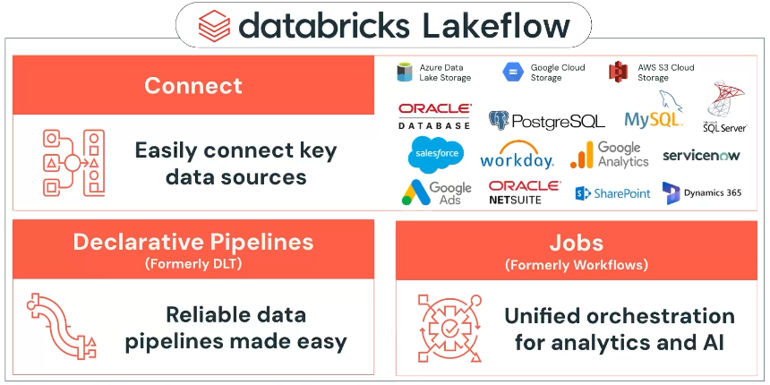

> **Source**: [Using Databricks for Data Engineering (Vimeo)](https://www.google.com/url?q=https://vimeo.com/1101578703/4a376b2584?fl%3Dpl%26fe%3Dvl&sa=D&source=editors&ust=1777921720796720&usg=AOvVaw1ydUVjE4rQSpfS1ZESjwZ4)

**NOTE**: *In addition, the Lakeflow Designer is a no-code experience meant to help any practitioner build data pipelines on top of Lakeflow.*

### Databricks SQL for Exploratory Analytics & Warehousing

"Now that we've gotten the data into the platform, we can now begin to actually explore and analyse it and even store it into warehouses for future use."

"Right! That's where Databricks SQL comes in, which uses ANSI SQL to expose data warehousing features built into various foundational components of the lakehouse architecture, including Delta Lake and Unity Catalog. And though we use ANSI SQL on the surface, operations under the hood happen in an optimised environment."

---

**NOTE: Warehousing features**:

In order to support data warehousing workloads and operations, many features are necessary, including: materialised views, rule-based access controls, etc. These features are built into various foundational components of the data lakehouse architecture and are exposed through an ANSI SQL interface.

---

"By optimised environment, do you mean scalability and performance?"

"Yes, and more specifically, cost for performance, i.e. you get more for the same cost compared to other platforms."

---

**SIDE NOTE: Additional feature to migrate data from legacy systems**:

Databricks offers proven methods, guidance and automatic toolings for migrating from legacy warehouses to Databricks in a fast and predictable manner.

### AI/BI for Business Intelligence Purposes

"You know what's the difference between inaccessible data intelligence and accessible data intelligence?"

"What?"

"Presentation!"

"And what solution does Databricks bring to the table, in this regard?"

"AI/BI — Artificial Intelligence/Business Intelligence. This has 2 components: AI/BI Dashboards and AI/BI Genie. AI/BI Dashboards, as the name suggests, helps bring together your queries, data and visualisations in a single interactive interface, an interface that's in fact a tool for further querying, data views and visualisations. This tool is enhanced with the Databricks Assistant, enabling you to create visualisations using natural language prompts."

"Natural language prompts? Wow, very handy. Even so, someone who makes the dashboard cannot anticipate every query a user may have. What about that?"

"Ah, yes. To handle a wider range of queries from users that may exceed the scope of a dashboard, we have AI/BI Genie, which provides a space for natural language queries in a chat-like format."

---

**CONCEPTUAL NOTE: The importance of business intelligence (BI)**:

BI is all about making data, analysis and insights actionable. This intent differentiates it from AI and data analysis.

### Mosaic AI for AI/GenAI Applications

"Mosaic AI is a suite of tools for end-to-end development of traditional and generative AI applications. Mosaic AI joined Databricks in 2023, and since then, its offerings and open-source tools (e.g. MLFlow and AutoML) are a part of Databricks, giving it not just BI capabilities but also AI capabilities, thereby approaching data intelligence more holistically."

**SIDE NOTE (explore separately)**: *Mosaic AI is a complete agent platform.*

### Conclusion: More than a Warehousing Alternative

"Databricks is not about analytics or artificial intelligence, but rather, it is about data intelligence that combines analytics, AI and BI. And everything it combines stays true to its core intent: enable and empower data intelligence while making it accessible to decision-makers at various levels of expertise and experience."

"Right. Or, in other words, it's about making data comprehensible, accessible and actionable at a strategic level."

"Well put. Needless to say, though, you can certainly use Databricks as a potent warehousing alternative, for at its core, it is built around the data lakehouse architecture. That is its core, and everything else adds to it but doesn't supplant or surpass it in importance."

"I see. So, the unique selling point of Databricks is not necessarily in its particular offerings, but in the fact that it unifies the tools and environments needed for data intelligence, facilitating integration of data and insights across a range of purposes a user or organisation may have."

"Right. Its unique selling point comes from the fact that it is a platform, not a suite of products."

# Key Concepts of Databricks

## Namespace Structure

"Unlike legacy warehouses, which have a 2 level namespace (databases at the top level, under which come tables, views, etc.), Databricks has a 3 level namespace:

L1:

Catalog, a top-level container for all our data and AI assets.

L2:

Schemas:

- Somewhat analogous to databases in legacy warehouses
- However, schemas in Databricks hold more than just data (see L3)

L3:

Children of the schema, which can be tables, views, volumes, functions and models."

"I see. L1, i.e. the catalog, is what enables you to integrate the data and AI assets needed by a project or organisation, and being able to have more than one catalog enables multi-project isolation, i.e. it enables you to deal with multiple separate projects and organisations within a single platform! And schemas are great for keeping interrelated or interdependent assets together."

"Rightly stated. Now, if you want to go through your catalogs, you can do so using the UI through which Unity Catalog is exposed, labelled "Catalog" in the sidebar in your Databricks page. Don't be fooled: the "Catalog" tab doesn't refer to a single catalog but the catalog of catalogs! Ah, and it's key to note that Unity Catalog runs not on a Databricks cluster (i.e. a deployment) but on the account-level/region-level (region being a logical separation within the account) as a service managed by Databricks for the concerned account/region within the account. Hence, the catalogs listed are the catalogs across workspaces in the concerned account/region within the account (we'll discuss workspaces shortly)."

> **Additional reference**: [What is Unity Catalog? - Azure Databricks | Microsoft Learn](https://www.google.com/url?q=https://learn.microsoft.com/en-us/azure/databricks/data-governance/unity-catalog/&sa=D&source=editors&ust=1777921720807901&usg=AOvVaw0jZ3aJonw5drRDu_bAcRu_)

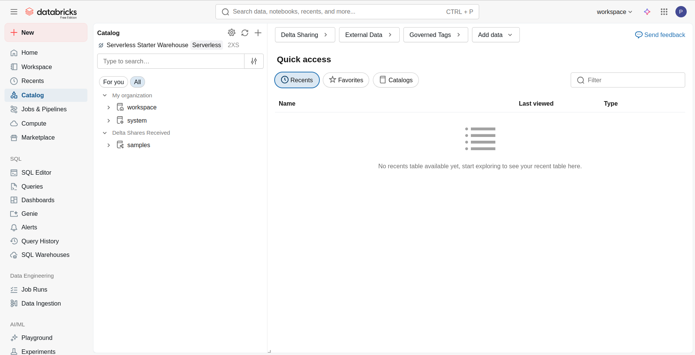

---

**CONCEPTUAL, TERMINOLOGICAL AND PRACTICAL CONFUSION: Catalog vs. Unity Catalog**:

"Catalog" as discussed here is distinct from the "Catalog" tab in the UI. As mentioned, the tab actually refers to Unity Catalog, which is partially exposed through the "Catalog" tab. And "catalog" as a namespace layer is obviously different from Unity Catalog, which is the catalog for an entire Databricks workspace (i.e. a deployment/instance; workspaces are explored below). A simple way to think of this is:

- Unity Catalog is a system
- A catalog is a container

## Workspace

"Now that we understand how data is organised within Databricks' namespace, let's consider where the work of dealing with this data happens. A namespace defines data boundaries. A workspace, however, defines computational boundaries, i.e. the working environment through which you can access Databricks assets. Before you confuse them with catalogs, understand that:

- Catalogs organise data and AI assets <br> (tables, models, files, functions)
- Workspaces organise people and computational work <br> (users, notebooks, jobs, clusters)

Practically, it's the distinction between "where I work" (workspace) with "what data I see/have access to" (catalog(s)). Conceptually, this is analogous to the difference (in computer systems) between execution environment (workspace) and namespace (catalog). Thus, as you can expect, workspaces and catalogs operate at different layers of the platform architecture:

```
┌──────────────────────────────────────────┐
│  WORKSPACE (Computational Boundary)      │
│  ┌────────────────────────────────────┐  │
│  │ Users, Teams, Access Control       │  |
│  │ Notebooks, Jobs, Clusters          │  │
│  │ Computational Resources            │  │
│  └────────────────────────────────────┘  │
│             ↓ accesses ↓                 │
│  ┌────────────────────────────────────┐  │
│  │  CATALOGS (Data Boundary)          │  │
│  │ └─ Schemas                         │  │
│  │    └─ Tables, Views, Functions     │  │
│  │    └─ Volumes (files)              │  │
│  │    └─ Models                       │  │
│  └────────────────────────────────────┘  │
└──────────────────────────────────────────┘
```

**SIDE NOTE**: *Accounts define the administrative/billing boundary, as we shall see.*

Let's have a look at what's said in [Databricks components | Databricks on AWS](https://www.google.com/url?q=https://docs.databricks.com/aws/en/getting-started/concepts&sa=D&source=editors&ust=1777921720812328&usg=AOvVaw0RgV88sKSEuyRgTAIgxvcG):

In Databricks, a workspace is a Databricks deployment in the cloud that functions as an environment for your team to access Databricks assets. Your organisation can choose to have either multiple workspaces or just one, depending on its needs. A Databricks account represents a single entity that can include multiple workspaces. Accounts enabled for Unity Catalog can be used to manage users and their access to data centrally across all of the workspaces in the account. Billing and support are also handled at the account level."

"Hm. Interesting. If a workspace is a Databricks deployment, i.e. an instance (active or passive) of the Databricks platform, your definition of a workspace in Databricks as a computational boundary makes a lot of sense. And naturally, we can have multiple instances of the Databricks platform for multiple independent use-cases (independent, because that's what each instance is to other instances). An account, then, is more of a way to organise the practical nitty-gritties of workspaces, which involves billing and support, as the article says."

"Right. And since a workspace is just a deployment without being tied to one or more catalogs as such, one workspace can access multiple catalogs, and multiple workspaces can share one catalog."

"Interesting. But what exactly "lives" in a workspace? Surely not the catalogs, for we access them through a workspace, so what's in the domain of a workspace as such?"

"These entities:

- People: Users with roles (admin, user, viewer)
- Notebooks: Where code is written and executed
- Jobs: Scheduled or triggered workflows
- Clusters: Compute resources (Spark clusters)
- Dashboards: BI visualisations (AI/BI dashboards)
- Repos: Git integration for version control
- Secrets: Encrypted credentials and API keys"

"I see. So, if I may sum it up in a simplified way: Catalogs organise the data. Workspaces organise the people and their means of using the data. Oh, and accounts? Accounts organise the high-level administration and billing!"

"Yeah, that's what we as practitioners need to keep in mind."

---

**TECHNICAL NOTE: Enabling Unity Catalog for a workspace**:

Enabling Unity Catalog for a workspace is essentially making Unity Catalog's offerings available to you for your Databricks deployment. In most accounts, Unity Catalog is enabled by default when you create a workspace. You can get started using Unity Catalog with the default settings. There are optional configurations that you might want to enable, however. This page gives an overview of both:  
[Get started with Unity Catalog | Databricks on AWS](https://www.google.com/url?q=https://docs.databricks.com/aws/en/data-governance/unity-catalog/get-started&sa=D&source=editors&ust=1777921720815680&usg=AOvVaw1SgKj1TR13pQed8Tf7f0Qt)

**CONCEPTUAL NOTE: Unity Catalog as a catalog of the workspace vs. catalogs**:

To somewhat reiterate a point made in the previous section, Unity Catalog presents a catalog of all the data and AI assets in a Databricks workspace, and this is distinct conceptually and practically from a catalog in Databricks, which is a specific collection of schemas and their components. As mentioned previously:

- Unity Catalog is a system
- A catalog is a container

**TECHNICAL NOTE: Clarifications about the UI regarding workspaces**:

In the Databricks web UI, you select your workspace here (see top-right corner of the page; here, I have only 1 workspace for this account, but if I had more, they would be listed here):

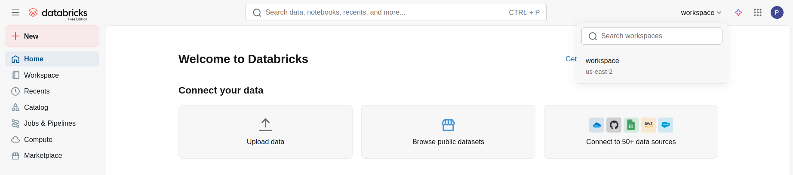

To manage assets within your selected workspace, select the "Workspace" tab (left side of the page):

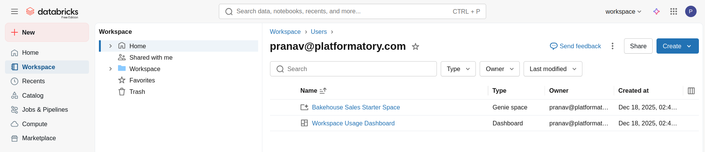

---

> **References**:
>
> - [Workspace UI | Databricks on AWS](https://www.google.com/url?q=https://docs.databricks.com/aws/en/workspace/&sa=D&source=editors&ust=1777921720818412&usg=AOvVaw2K5WhqRwgn_eHgEnsF-mzu)
> - [Workspace browser | Databricks on AWS](https://www.google.com/url?q=https://docs.databricks.com/aws/en/workspace/workspace-browser&sa=D&source=editors&ust=1777921720818714&usg=AOvVaw0SBYQZIlSKQnTk4MDaRBfS) (talks about Workspace root folder)
> - [Databricks components | Databricks on AWS](https://www.google.com/url?q=https://docs.databricks.com/aws/en/getting-started/concepts&sa=D&source=editors&ust=1777921720819058&usg=AOvVaw2dHYSeP8RjCKuK3GRFPmVK)
> - [Databricks Workspaces - Explained | by Sharath Samala | GeekyPy](https://www.google.com/url?q=https://geekypy.com/databricks-workspaces-explained-a62e5c8aad7d&sa=D&source=editors&ust=1777921720819357&usg=AOvVaw1ZiKr0lgF2ieoZ78wk6swz)

# Databricks for Data Engineering

> **Key references**:
> 
> - [Using Databricks for Data Engineering (Vimeo)](https://www.google.com/url?q=https://vimeo.com/1101578703/4a376b2584?fl%3Dpl%26fe%3Dvl&sa=D&source=editors&ust=1777921720819859&usg=AOvVaw2TbwGxjY3Cw2zlg0-DlUdY)
> - [Big Book of Data Engineering | Databricks](https://www.google.com/url?q=https://www.databricks.com/resources/ebook/big-book-of-data-engineering&sa=D&source=editors&ust=1777921720820117&usg=AOvVaw0VXk8qn11n9KvZohqVWfuC)

## What is Data Engineering?

"Here's the thing, Minerva."

"Hm?"

"When solving the problem of processing data, we don't merely want to solve this problem or that problem, and we don't want to solve any problem merely by figuring things out any which way. No, with its potentially diverse data sources and potentially diverse downstream applications, the system can be so complex that without principles to guide us in our problem-solving journey, we'd be lost, languishing or reinventing the wheel over and over."

"Well, judging by the discussion so far, yes, the system is indeed very complex. It was complex from the very problem statement of data integration to enable data intelligence."

"Indeed. Hence, we must approach the process of dealing with data in a principled way, applying our sharpness, insights and creativity where we can and need to, but always guided by core principles that cover the essentials of problem-solving in this domain!"

"Ah. Principled problem-solving — that's engineering, isn't it? And principled problem-solving to deal with data — ingesting it, transforming it, preparing it for use-cases and orchestrating this pipeline — this is data engineering, isn't it? So that's what we're getting into now!"

"Yes, indeed. And as with any kind of engineering, we must grasp its domain-specific principles."

"Ah, but before that, I want to get a better idea of what data engineers are supposed to be solving, exactly, because principles presuppose purpose!"

"Oh, right. Requirements before design! Let's first get to the purpose, then."

## Key Responsibilities of Data Engineers

"Here, I'll just systematise what we already know about what's needed to deal with data from the ingestion stage up to the stage before it's used for specific use-cases."

"Okay."

"The first responsibility of a data engineer is, of course, to transform raw data into clean, reliable data. In practice, this means:

- Data extraction from diverse sources
    - Diverse in format (CSV, Parquet, plaintext, images, etc.)
    - Diverse in processing type (batch vs. stream)
    - Diverse in origin (cloud storage, local storage, databases, etc.)
- Cleansing the data to remove errors and inconsistencies
- Transforming it to convert it into a structured and usable format for consumers"

"So, from this, am I to understand that "clean" and "reliable" refer to being properly formatted with redundancies removed (clean) as well as accurate, consistent and durable (reliable)?"

"That's a fair expansion. Now, for the second responsibility, that is tied to ensuring the first responsibility is properly covered and extended long-term: ensuring the quality and integrity of data, which implies:

- Developing processes to monitor and maintain:
    - Data accuracy
    - Data consistency
    - Data reliability (accuracy + consistency + durability)
- Keeping data trustworthy and usable across time <br> *Especially as this data is accessed, used and updated over and over across time*"

"Ah. So the first responsibility is the basic function, the second responsibility is ensuring this basic function is and can be done reliably long-term."

"Indeed! And to enable these 2 responsibilities in a systematic, scalable and potentially automated way (to ensure reliability and scalability as well as reduce manual errors), the third responsibility of a data engineer is to design, build and maintain data pipelines."

"Data pipelines? Are these... the chain of tasks, transformations and transfers through which data flows from sources to storage to consumers?"

"Exactly. Creating, optimising and potentially automating these pipelines is a key responsibility of a data engineer."

"Hm. Interesting. I wonder how these responsibilities fit into the bigger picture of data architecture?"

"I like this question! Hm, so let me see... Data architecture is the "blueprint", or more precisely, the conceptual design — i.e. the models, rules, and standards — for managing data assets throughout their lifecycle to support broader goals of a project, team or organisation. The way data engineering fits into data architecture is, essentially, as the engine that drives the flow of data! Have a look at the diagram below..."

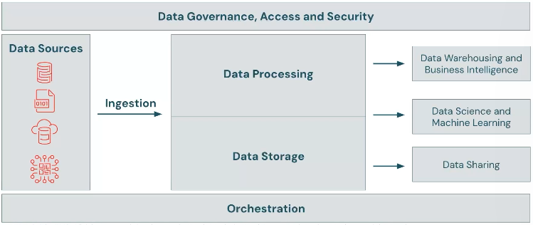

> **Source**: [Using Databricks for Data Engineering (Vimeo)](https://www.google.com/url?q=https://vimeo.com/1101578703/4a376b2584?fl%3Dpl%26fe%3Dvl&sa=D&source=editors&ust=1777921720827047&usg=AOvVaw3qHq7uyCJiwOIRrM4ZHali)

"Ah. So, data engineering is the part of the architecture that gets the assets into the system and prepares them for further use further along the system, and throughout the asset's lifecycle, it maintains its integrity and quality."

"Yes, an astute summary!"

## Principles of Data Engineering

"Now that we've gotten an idea about the "why" data engineering, let's get into its principles. These are the principles proposed by AWS, so don't take them as gospel. However, these principles do encapsulate what makes effective data engineering in practice effective."

"Enough suspense! What are the principles?"

"First, you must understand what for —"

"Ugh!"

"Patience, my friend. These are architectural principles for designing and developing a data pipeline, especially in the modern cloud-computing context."

"Okay, got it. Wait, that's just the third responsibility, though?"

"Yes, but you see, the first two responsibilities are about actions, or tasks, not problem-statements. Only the third responsibility is a problem-statement, which both integrates the two other responsibilities through design! Designs and their development is where architectural principles come in."

"Ah, I see. Out with the principles then."

"Right. The first principle is flexibility. You see, a data engineer must be able to wrangle data from diverse sources. How do they get ingested into the data pipeline? Evidently, you'd need some set of tools or services. And if you're using tools and services, you don't want vendor lock-in or a lack of compatibility with the data formats that work for the rest of the pipeline. Moreover, you may likely want to handle a variety of workloads — i.e. a variety of pipelines and job orchestrations — within the same data architecture. So, flexibility! As an example, the "microservice architecture" is a way to adhere to this principle. Look it up, for it's beyond the scope of our discussion, but it's valuable!"

"I will. But before we move on, let me point out that no matter how flexible the system is, flexibility can be complex, because the very purpose of flexibility here is to tackle complexity! So, let's say I design a flexible system, and I want to apply it for other use-cases or areas of business or whatever. I mean, it's not an app that I can just install elsewhere, it's a whole system!"

"Ah, and here, we come to the second principle: reproducibility. It's the principle that addresses the problem of, well, reproducing a complex system in another environment. A nice example of this is the use of "infrastructure-as-code", as with Terraform, which, through declarative statements, specifies the resource-provisioning and configurations for the system. And a sister principle of this is reusability, which is the approach of using libraries and references (for documentation, data source, etc.) in a shared manner — and sharing is sort of the heart of reproducibility as well, isn't it?"

"Hm. Quite apt, so far. However, let's address the elephant in the room, shall we? BIG DATA? That's what data engineers would tend to tackle whenever they engage with ambitious or more wide-ranging projects, from global real-time social media systems to city-wide delivery services to large-scale data analytics."

"Ah, and the principle to address the concerns of big data is, naturally, scalability! Why do you think we were so keen to integrate data lakes and involve ourselves with data lakehouses? For scalability, of course. And scalability is the reason why our data platforms work on distributed computing architecture — even Databricks is built on Apache Spark, a distributed computing engine + framework for tackling data processing as in independent chunks of data dealt with parallely, which is the kind of distributed computing that's very useful in data engineering."

"Very nice. And I suppose, to cap it off, we must have a way to, you know, manage our data assets, for policy compliance and security and whatnot? Governance! Like with Unity Catalog!"

"Yes, and that brings us to the last principle: auditability. Keeping transaction/transformation logs (as in Apache Spark), having version-control for data (as with Delta Lake), and being able to catalog our data assets (as with Unity Catalog) are examples of this principle in practice. You see how crucial it is that it's embedded in the very technologies and framework we use to address the other principles?"

"I do see it, and I love to see how tied together these principles are, in theory and in practice."

> **Reference**: [Data engineering principles - AWS Prescriptive Guidance](https://www.google.com/url?q=https://docs.aws.amazon.com/prescriptive-guidance/latest/modern-data-centric-use-cases/data-engineering-principles.html&sa=D&source=editors&ust=1777921720833629&usg=AOvVaw0bCOgb9H9WU7vYDmSAem8L)

## Databricks-Enabled Data Engineering

"Now that we've gotten an idea about the "why" of data engineering and its principles, let's get into the "why" of Databricks with respect to data engineering."

"Oh yeah, that's the question, now, isn't it? But we've sort of answered it already. It's about data integration! Data from multiple sources, in multiple formats, for multiple different downstream use-cases... I mean, if an organisation is drawing data from disparate sources, can you imagine the decentralisation! Different teams to handle different kinds of data, myriad tools with their own myriad interfaces and architectures that may not be meant to work together, and separate data pipelines for separate kinds of data... Oh, this is the mess we wanted to tidy up conceptually with the data lakehouse architecture, and manage more comprehensively with the data intelligence platform that is Databricks!"

"That's right. And add this to the need to ensure data quality (we don't want a GIGO situation), the governance of data assets, and scaling up the data pipelines... and we have a nightmare in the waiting, if it's not already upon us. Databricks is an apt solution, since not only does it implement the data lakehouse architecture to make the data lake manageable and queryable, but it also implements a number of downstream applications, from data and AI governance (using Unity Catalog) to SQL querying to AI/BI natural language querying and dashboards (although this last bit is a use-case that is further downstream rather than data engineering proper)."

"I want to get an idea how it'd work!"

"Alright. Remember the diagram showing the way data engineering fits into data architecture? Well, here is the Databricks-enabled integration of data engineering, which shows how the various offerings of Databricks fit into the data architecture in general, from which you can see which offerings work for data engineering in particular. Just have a look..."

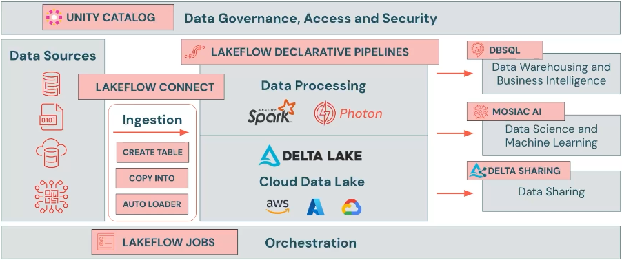

> **Source**: [Using Databricks for Data Engineering (Vimeo)](https://www.google.com/url?q=https://vimeo.com/1101578703/4a376b2584?fl%3Dpl%26fe%3Dvl&sa=D&source=editors&ust=1777921720836827&usg=AOvVaw2SKyJxK16-ByS4AysHsQd4)

"Ah, yes, Lakeflow for ETL (extract-transform-load) operations, with Lakeflow Connect for ingestion, Lakeflow Declarative Pipelines to use SQL and Python to handle streaming data, data quality and error controls, Lakeflow Jobs to orchestrate and automate the tasks that together make up the data pipeline. And, of course, Unity Catalog for data governance and security. To put this in perspective, Databricks is a data engineer's means of integrating diverse data sources and data pipelines with tools that use interoperable APIs and data formats, and with the means to orchestrate the ingestion, processing and transformation of these data... all within one platform that has a unified cataloguing and governance of data assets. In short, Databricks facilitates data integration with flexibility (in data sources and data/workflow types) and structure (since tools are interoperable and can be orchestrated as such)."

"That's right! That's the key idea: flexibility with structure. On top of this, the Databricks Assistant is an AI tool that acts as a coding copilot and companion, which can be convenient for creating and correcting code. You may think it's icing on the cake, but it's a pretty big deal in lowering the barrier of entry into Databricks (in line with the Databricks' intent of "democratising data intelligence") as well as facilitating the often cumbersome coding process. Okay, now that we have a "why" for Databricks with respect to data engineering, let's get into the "how", shall we?"

---

**TECHNICAL NOTE: Using open standards and having a whole host of compatible migration technologies**:

The Databricks data intelligence platform is built on open source technologies and uses open standards, so leading data solutions can be leveraged with anything you build on the lakehouse. A large collection of technology partners makes it easy and simple to integrate the technologies you rely on when migrating to Databricks — and you are not locked into a closed data technology stack.

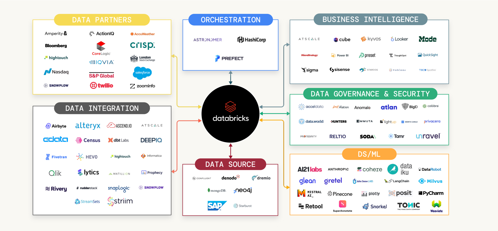

> **Source**: [Big Book of Data Engineering | Databricks](https://www.google.com/url?q=https://www.databricks.com/resources/ebook/big-book-of-data-engineering&sa=D&source=editors&ust=1777921720840558&usg=AOvVaw36qSHiZaaGIbTpig9JaNkR)

## Read More

For deeper technical detail and focus: [Databricks for Data Engineering](https://www.google.com/url?q=https://docs.google.com/document/d/1kN-2ZgJ6Gz4e5Yq79YK2mGBXbtqShVsqgkCawEOSnUU/&sa=D&source=editors&ust=1777921720841085&usg=AOvVaw2KfqrxfNqUSetpOSXtAhBG)